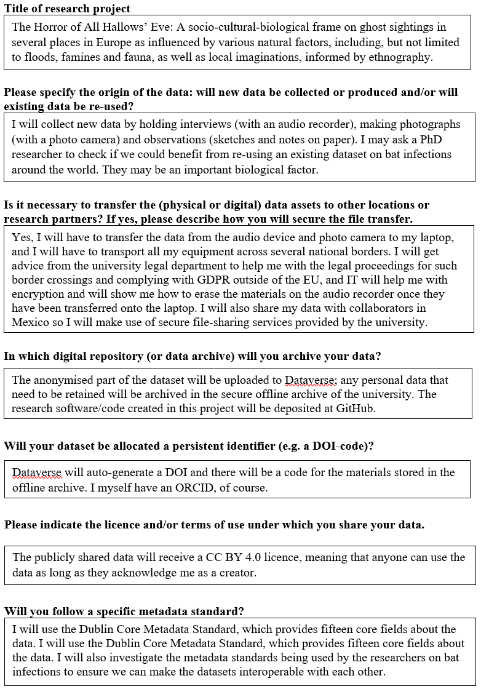

The Professor might have left the office open, but at least the computer is
locked so no-one can mess with his files.

Maybe the computer offers a way out of the office. But... you need a
password... how and where can you find it?

<form novalidate>
  <label>
    Enter the pass code sentence to access the computer (ALL CAPS)
    <input required pattern="GOOD PLANNING HELPS AVOID DATA HORROR" class="w-100">
  </label>
  
That's not it.

  <button>Check</button>
  <blockquote class="form-if-correct">
    <h2>Data Management Plan</h2>
    
Please read this Data Management Plan before submitting

    

      Lead researcher: Professor Hutseephluts 
      ORCID: 0000-7f80-9074-7564 
      Others with data management responsibilities: PhD candidate (name to be confirmed). 
    

    
This is the first version of the data management plan of the research project about ghost sightings around Halloween. A Data Management Plan (DMP) is a living document, and will be updated as the project progresses.

    
  </blockquote>
</form>
