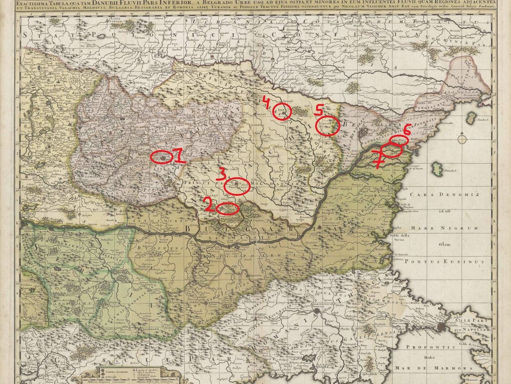

---
paths:
  - label: 'Read the note'
    url: 'https://rdm.vu.nl/topics/safe-data-transfer.html'
  - label: 'Read the travel schedule'
    url: 'office/map/schedule/'
  - label: "Take a look around Professor Hutseephluts' office"
    url: 'office/'
---

<figure>
    
    <figcaption><a href="http://imagebase.ubvu.vu.nl/getobj.php?ppn=382036441">Taken from Image base VU</a></figcaption>
</figure>

Next to this map, a folded-up note and a travel schedule is taped to the wall.
