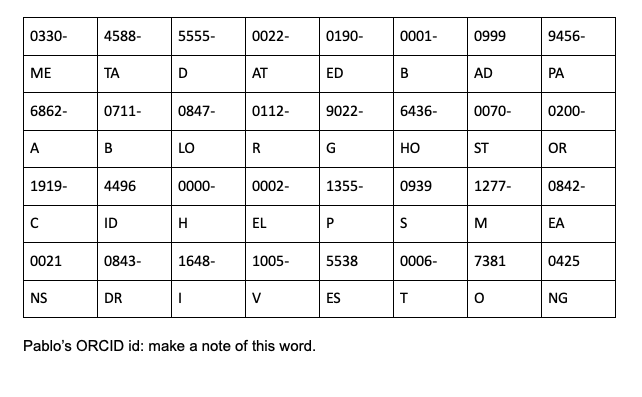

# Coded sheet

  
Hint

  
An ORCID id is a 16-digit code (you can read more about it on a flyer on the
  noticeboard or on the ORCID website). There are a couple of places on the
  noticeboard where you will find a DOI that can be googled, or a direct link,
  that leads to a dataset belonging to Pablo and his colleagues. His ORCID id can
  be found by hovering over (or clicking) the ORCID logo by his name and looking
  at the 16-digit code that is a part of the URL. Make a note of Pablo's ORCID id
  and use it to decipher the coded sheet.

