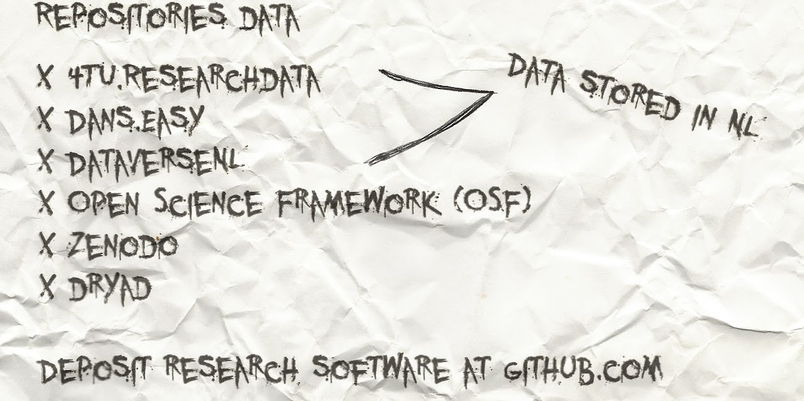

# Hidden document 2

  
Transcription

  <blockquote>
    
Repositories Data

    <ul>
      <li>
        Data stored in NL
        <ul>
          <li><a href="https://data.4tu.nl/">4TU.ResearchData</a></li>
          <li><a href="https://easy.dans.knaw.nl/">DANS.EASY</a></li>
          <li><a href="https://dataverse.nl/">DataverseNL</a></li>
        </ul>
      </li>
      <li><a href="https://osf.io/">Open Science Framework (OSF)</a></li>
      <li><a href="https://zenodo.org/">Zenodo</a></li>
      <li><a href="https://datadryad.org/">Dryad</a></li>
    </ul>
    
Deposit research software at <a href="https://github.com">github.com</a>

  </blockquote>

This one's a hand-written note. Is it the Professor's handwriting? Was the
Professor trying to investigate data repositories...? And a place to deposit
his research software/code? It seems that there is a common theme.
